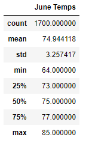
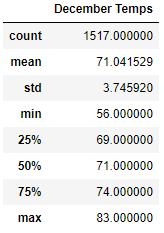

# Surfs Up
Code: 
## Purpose
After a trip to Hawaii, I would like to open a Surf and Shake Shop there. I created a business plan and presented it to W. Avy, a possible investor. He likes the idea but is worried about the weather and how it could impact the shop. So, he wants us to analyze the weather as the weather before he invests. After our intial analysis of the weather, he would like us to compare the weather in June and December. 
## Results
\

- The mean in June is only about 3.9 degrees more than the mean in December. However, this could be because of some outliers in December so let's take a look at something else.
- The standard deviation in December is about .49 degrees more than the standard deviation in June. This means that the varation in temperature is not much more in December than it is in June from the mean for each.
- Lastly, let's look at the quartiles and medians. The first quartile for June is 4 degrees more than December and so is the median. The third quartile is 3 degrees more in June than December. This shows that there is not a significant difference between the distributions of June and December.
## Summary
My analysis show that there is not a significant difference between the distributions of June and December. The means has a 3.9 degree difference and the standard devation has a .49 degree difference. The quartiles and median are no more than 4 degree higher in June than December. This shows that December would not have a huge decline in customers at a surf and shake shop. There are additional querries I could do to look into the weather in June and December. I could create a bar graph showing the distribution of precipitation over each month and then compare them. I could also do a summary statistic of precipitation for each month.
